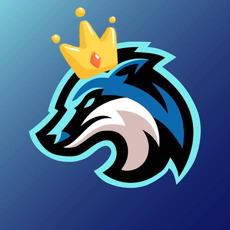
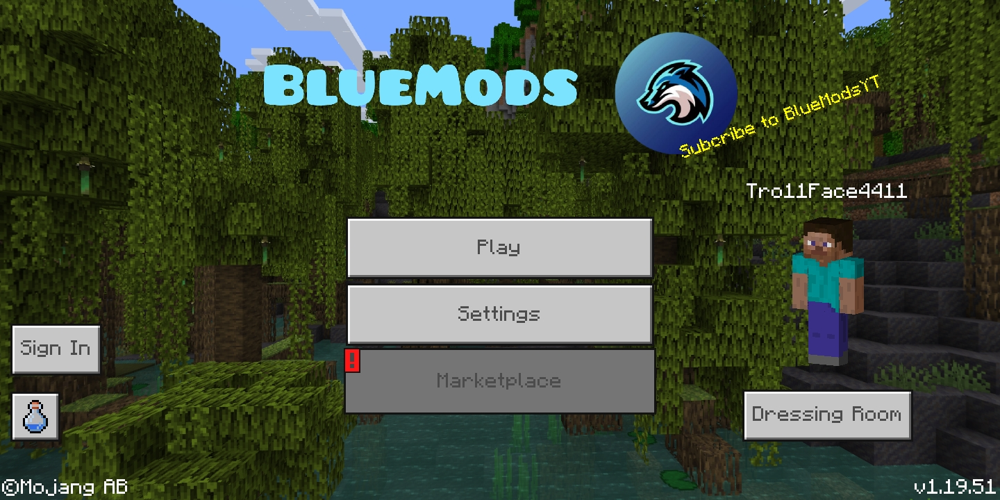

# BlueModsAC
BlueMods AntiCheat f
<h1 align="center">
   
  
   
  BlueMods AntiCheat
   
</h1>

<h4 align="center">BlueMods AntiCheat for Minecraft Bedrock is a powerful tool designed to protect your server from hackers, & cheaters</a>.</h4>

## AntiCheat Features :
**General Commands :**
> !help, !info, !ping, !admins, !op, !notify
**Gamemode Commands :**
> !gma, !gmc, !gmsp, !gms, !vanish, !tpa
**Moderation Commands :**
> !ban, !unban, !clearchat, !clearlag, !cmdsf, !kill

## How To Use
1. if you want to see all of commands type !help to see it.  
2. to make yourself admin or bypass the AntiCheat you must have admin tag 
Try : !admin (user) you must mention the user to give the tag or yourself  
3. does those chat are annoying and alots of commands on your chat list? 
Try : !clearchat to remove annoying chat list 
Try : !cmdsf to disable annoying commands showing up on chat list.  
4. does anyone insulting or bullying to other players ? 
Try : !mute (user) to mute or timeout user 
Try : !unmute (user) to unmute for talking user.  
5. people are hacking, cheating, nuking, & using reach hacks? 
Try : !ban (user) to ban current user on your server 
Try : !unban (user) to unban current user on your server.

## Download
> [Click me to Download](https://bluemods.neocities.org)
> [Download on Discord](https://dsc.gg/bluemods)

## GUI

## Credits
**Creators/Developers**
- [BlueMods / BluexD#7232](https://dsc.gg/bluemods)
- [! MP09#1560](https://discord.gg/9J3Nhb7ggg)

**Apps Used to Edit**
- [MT Manager](https://mt2.cn)

## Links
> [Discord Community](https://dsc.gg/bluemods)
> [Official Websites](https://bluemods.neocities.org)
> [Youtube Channel](https://youtube.com/@BlueModsYT)

or Minecraft Bedrock is a powerful tool designed to protect your server from hackers, &amp; cheaters
